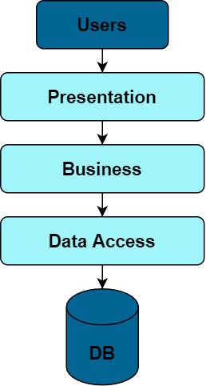

# O que é DAO

Data Access Object ou DAO é um Design Pattern aplicado em cima da camada de aplicacao Data Access.

Tem como principal objetivo a separacao do acesso de dados das regras de negócio, diminuindo assim, o acoplamento entre as camadas.